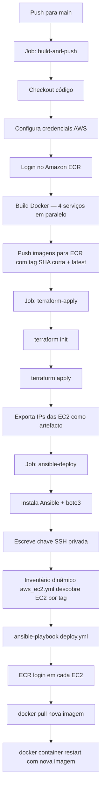
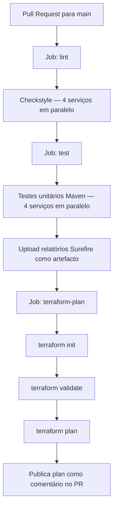

# Arquitetura

## Visão Geral

A plataforma mini-ecommerce é um sistema de microsserviços deployado na AWS (região `eu-central-1`). Todos os serviços correm dentro de containers Docker em instâncias EC2. A infraestrutura é provisionada com Terraform e organizada em módulos reutilizáveis. As imagens Docker são construídas pelo pipeline GitHub Actions, armazenadas no Amazon ECR e distribuídas às instâncias EC2 via Ansible.

---

## Diagrama de Componentes

```
┌──────────────────────────────────────────────────────────────────────┐
│                          AWS eu-central-1                            │
│                                                                      │
│  ┌──────────────────────────────────────────────────────────────┐    │
│  │  Amazon ECR                                                  │    │
│  │  ├── api-gateway:<tag>                                       │    │
│  │  ├── catalog-service:<tag>                                   │    │
│  │  ├── order-service:<tag>                                     │    │
│  │  └── notification-service:<tag>                              │    │
│  └──────────────────────────┬───────────────────────────────────┘    │
│                             │ docker pull (via Ansible)              │
│  ┌──────────────────────────▼───────────────────────────────────┐    │
│  │  VPC  10.0.0.0/16                                            │    │
│  │                                                              │    │
│  │  ┌──────────────────────────┐                                │    │
│  │  │  Subnets Públicas        │                                │    │
│  │  │  10.0.1.0/24 (eu-c-1a)   │                                │    │
│  │  │  10.0.2.0/24 (eu-c-1b)   │                                │    │
│  │  │                          │                                │    │
│  │  │  ┌────────────────────┐  │                                │    │
│  │  │  │  EC2: api-gateway  │  │◄─── Internet (Cliente/curl)    │    │
│  │  │  │  porta 8080        │  │                                │    │
│  │  │  └────────┬───────────┘  │                                │    │
│  │  └───────────┼──────────────┘                                │    │
│  │              │                                               │    │
│  │  ┌───────────┼───────────────────────────────────────────┐   │    │
│  │  │  Subnets Privadas                                     │   │    │
│  │  │  10.0.10.0/24 (eu-c-1a)                               │   │    │
│  │  │  10.0.20.0/24 (eu-c-1b)                               │   │    │
│  │  │              │                                        │   │    │
│  │  │    ┌─────────┴──────────┐   ┌────────────────────┐    │   │    │
│  │  │    │  EC2:              │   │  EC2:              │    │   │    │
│  │  │    │  catalog-service   │   │  order-service     │    │   │    │
│  │  │    │  porta 8082        │   │  porta 8083        │    │   │    │
│  │  │    └────────┬───────────┘   └────────┬───────────┘    │   │    │
│  │  │             │                        │                │   │    │
│  │  │    ┌────────▼───────────────────┐    │                │   │    │
│  │  │    │  RDS PostgreSQL            │◄───┘                │   │    │
│  │  │    │  modulos-database          │                     │   │    │
│  │  │    │  subnet privada            │                     │   │    │
│  │  │    └────────────────────────────┘                     │   │    │
│  │  │                                      │                │   │    │
│  │  │    ┌─────────────────────────────────▼──────────┐     │   │    │
│  │  │    │  Fila SQS: order-created                   │     │   │    │
│  │  │    │  DLQ: order-created-dlq (máx. 5 tentativas)│     │   │    │
│  │  │    └────────────────────────────────────────────┘     │   │    │
│  │  │                           │                           │   │    │
│  │  │    ┌──────────────────────▼─────────────────────┐     │   │    │
│  │  │    │  EC2: notification-service                 │     │   │    │
│  │  │    │  porta 8081                                │     │   │    │
│  │  │    └────────────────────────────────────────────┘     │   │    │
│  │  └───────────────────────────────────────────────────────┘   │    │
│  └──────────────────────────────────────────────────────────────┘    │
└──────────────────────────────────────────────────────────────────────┘
```

---

## Diagrama CI/CD



---

## Diagrama Pipeline PR



---

## Fluxo de Dados

### Criar uma Encomenda

1. O cliente envia `POST /orders` ao **api-gateway** (EC2 público, porta 8080).
2. O api-gateway encaminha o pedido para o **order-service** (`http://order-service:8083`).
3. O order-service persiste a encomenda no **RDS PostgreSQL** e publica um evento `order-created` na **fila SQS**.
4. O **notification-service** consome o evento da SQS. O envio de email via SES não está operacional na configuração atual (ver `docs/limitations.md`).

### Consultar o Catálogo

1. O cliente envia `GET /products` (ou similar) ao **api-gateway**.
2. O api-gateway encaminha para o **catalog-service** (`http://catalog-service:8082`).
3. O catalog-service consulta o **RDS PostgreSQL** e devolve o resultado.

### Fluxo de Deploy (CI/CD)

1. O GitHub Actions faz build de 4 imagens Docker em paralelo (uma por serviço).
2. As imagens são enviadas para o **Amazon ECR** com uma tag baseada no SHA curto do commit e uma tag `latest`.
3. O **Terraform** aplica quaisquer alterações à infraestrutura e exporta os IPs das EC2.
4. O **Ansible** usa um inventário dinâmico (`aws_ec2.yml`) para descobrir as instâncias EC2 pelo tag `Project: mini-ecommerce` e pelo tag `Name` (ex: `api-gateway`, `catalog-service`).
5. Em cada EC2, o Ansible faz login no ECR, faz pull da nova imagem e reinicia o container com `restart_policy: always`.

---

## Módulos de Infraestrutura

| Módulo | Recurso | Notas |
|--------|---------|-------|
| `vpc` | VPC, subnets públicas/privadas, tabelas de rotas, security groups | 2 AZs (eu-central-1a, eu-central-1b) |
| `ec2` | Instância EC2 | Reutilizado pelos 4 serviços; Docker instalado via `user_data` |
| `rds` | RDS PostgreSQL | Deployado em subnet privada; `db_sg_id` restringe o acesso |
| `sqs` | Fila SQS + DLQ | Fila `order-created` com DLQ de 5 tentativas; visibility timeout de 30s |

---

## Stack Tecnológica

| Camada | Tecnologia |
|--------|------------|
| Serviços | Java / Spring Boot |
| Containerização | Docker, Docker Compose |
| Registo de imagens | Amazon ECR |
| Infraestrutura | Terraform ≥ 1.5, AWS |
| Automação de deploy | Ansible (inventário dinâmico AWS EC2) |
| CI/CD | GitHub Actions |
| Base de Dados | PostgreSQL no RDS |
| Mensageria | AWS SQS (fila standard) |
| Rede | AWS VPC (subnets públicas + privadas, 2 AZs) |

---

## Comunicação entre Serviços

| Origem | Destino | Protocolo | Endereço |
|--------|---------|-----------|----------|
| api-gateway | catalog-service | HTTP | IP privado da EC2 na porta 8082 |
| api-gateway | order-service | HTTP | IP privado da EC2 na porta 8083 |
| order-service | RDS PostgreSQL | JDBC/TCP | Endpoint RDS na porta 5432 |
| order-service | SQS | HTTPS | Endpoint AWS SQS |
| notification-service | SQS | HTTPS | Endpoint AWS SQS |

O Ansible injeta os IPs privados das EC2 como variáveis de ambiente no api-gateway no momento do deploy, usando o inventário dinâmico para resolver os grupos `catalog-service` e `order-service`.

---

## Segurança de Rede

- O **api-gateway** encontra-se numa **subnet pública** e é o único componente exposto à internet.
- Todos os outros serviços (catalog, order, notification) encontram-se em **subnets privadas** sem acesso direto à internet.
- O RDS está numa subnet privada e protegido por um security group dedicado (`db_sg_id`) que apenas permite tráfego do security group da aplicação (`web_sg_id`).
- A comunicação entre o api-gateway e os serviços privados acontece pelo routing interno da VPC.
